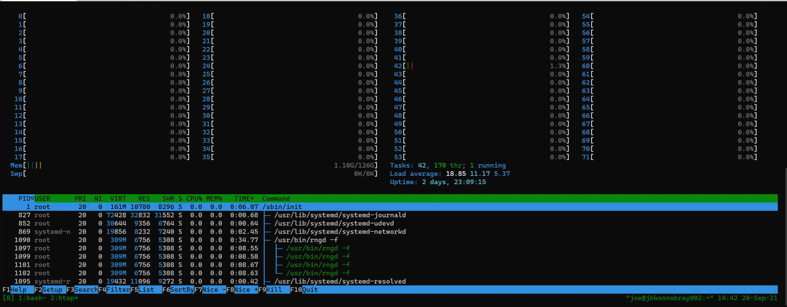
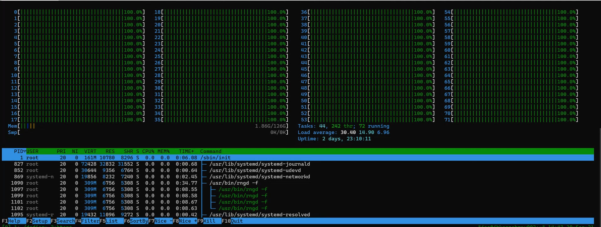

.. _opendcdiag-user-guide:

Prerequisites for building
##########################

Your build environment should contain the newest possible releases of
tools to obtain the results in these examples. The tests exercise
particular instructions; if you don’t have a toolchain that supports
those instructions, then the test content cannot be compiled. Therefore,
you must have a modern compiler toolchain—the newest are preferred. The
binary may not build if you have an older version of your preferred OS.
We recommend the following versions of the necessary tools and library
dependencies to build the binary:

-  GCC 10.2 at a minimum, GCC >=11 is preferred

-  Eigen\* >=3.3.8

-  Zlib >=1.2.11

-  libzstd >= 1.4.5

-  binutils >= 2.37

-  boost >= 1.69

-  Meson >= 0.56

The following versions of OSes have the correct dependencies:

-  Ubuntu\* >=21.04

-  Fedora\* >=33

-  Debian sid

Additionally, your system must use first-generation Intel® Core™ (Intel®
microarchitecture code name Westmere) or newer architecture to run the
tests. The default build assumes fourth-generation Intel® Core™
(Haswell) or newer architecture.

Quick-start steps
*****************

Clone the repo
==============

Start with a pristine clone of the repository: ::

    $ git clone https://github.com/opendcdiag/opendcdiag.git

    $ ls -hln opendcdiag

    total 68K
    drwxr-xr-x 2 1000 1000 6 Nov 1 15:07 build
    -rw-r--r-- 1 1000 1000 3.4K Oct 14 08:10 CODE_OF_CONDUCT.md
    -rw-r--r-- 1 1000 1000 1.3K Oct 15 11:43 CONTRIBUTING.md
    drwxr-xr-x 2 1000 1000 59 Nov 1 09:48 docs
    -rw-r--r-- 1 1000 1000 13K Oct 14 08:10 Doxyfile
    drwxr-xr-x 8 1000 1000 4.0K Nov 1 09:48 framework
    -rw-r--r-- 1 1000 1000 12K Sep 20 16:07 LICENSE
    -rw-r--r-- 1 1000 1000 3.2K Oct 13 08:23 LICENSE.3rdparty
    -rw-r--r-- 1 1000 1000 5.3K Oct 28 14:29 meson.build
    -rw-r--r-- 1 1000 1000 485 Oct 15 11:43 meson-cross-win32.txt
    -rw-r--r-- 1 1000 1000 1.2K Nov 1 09:48 meson_options.txt
    -rw-r--r-- 1 1000 1000 2.8K Oct 15 11:43 README.md
    drwxr-xr-x 13 1000 1000 4.0K Oct 28 14:29 tests

Perform a basic build
=====================

OpenDCDiag uses the Meson build system. Like CMake, OpenDCDiag requires
you to build your binary outside the source tree, or at the very least,
in a different folder. ::

    meson builddir [options]
    ninja -C builddir

Meson performs a series of checks to ensure a sane environment. Options
to the configuration step can be passed in the "setup" line. ::

    $ meson builddir

    The Meson build system
    Version: 0.59.1
    Source dir: /home/1000/src/opendcdiag
    Build dir: /home/1000/BUILD
    Build type: native build
    Project name: opendcdiag
    Project version: undefined
    C compiler for the host machine: cc (gcc 11.1.0 "cc (GCC) 11.1.0")
    C linker for the host machine: cc ld.bfd 2.37
    C++ compiler for the host machine: c++ (gcc 11.1.0 "c++ (GCC) 11.1.0")
    C++ linker for the host machine: c++ ld.bfd 2.37
    Host machine cpu family: x86_64
    Host machine cpu: x86_64
    Program bash found: YES (/usr/bin/bash)
    Program perl found: YES (/usr/bin/perl)
    Program python3 found: YES (/usr/bin/python)
    Program sh found: YES (/usr/bin/sh)
    Found pkg-config: /usr/bin/pkg-config (1.8.0)
    Run-time dependency Boost found: YES 1.76.0 (/usr)
    Check usable header "boost/algorithm/string.hpp" : YES
    Check usable header "boost/type_traits/is_complex.hpp" : YES
    Run-time dependency threads found: YES
    Library dl found: YES
    Run-time dependency gtest_main found: YES 1.11.0
    Configuring gitid.h with command
    Configuring cpu_features.h with command
    Configuring weighted_runs.h with command
    Run-time dependency eigen3 found: YES 3.4.0
    Run-time dependency libzstd found: YES 1.5.0
    Run-time dependency zlib found: YES 1.2.11
    Build targets in project: 9

    opendcdiag undefined

         Configuration
            Logging format : yaml
            Min architecture : haswell
            Using main function : framework_main
            Using -march : -march=haswell
            Static libstdc++ : NO
            Executable name : opendcdiag
            Fallback executable name:

    Found ninja-1.10.2 at /usr/bin/ninja

Build options
=============

OpenDCDiag has extensive build options. Run the following to see the
complete list of options: ::

    $ meson configure builddir

Running OpenDCDiag
******************

Default execution
=================

This section documents the results of running OpenDCDiag without
options.

Execute the binary with the following command: ::

    $ ./builddir/opendcdiag

The console displays the following: ::

    $ ./builddir/opendcdiag
    command-line: 'opendcdiag'
    version: opendcdiag-c4a4ac9a3d00
    exit: pass

OpenDCDiag always generates log files while running. If no errors occur
during execution, the log file will be removed when the program exits.
If you want to retain the log file regardless of whether all tests pass
or fail, specify the -o flag: ::

    $ ./ builddir/opendcdiag -o

The log file has this naming convention: ::

    opendcdiag-YYYYMMDDTHHMMSS.SSSSSSZ

OpenDCDiag log output contains sparse descriptions of the tests, as
shown in the following example. Here, we show the OpenDCDiag executable
output results for the “@compression” test group to ``stdout``: ::

    $ ./builddir/opendcdiag -o - -e @compression
    THIS IS AN UNOPTIMIZED BUILD: DON'T TRUST TEST TIMING!
    command-line: 'opendcdiag -o - -e @compression'
    version: opendcdiag-c4a4ac9a3d00
    os: Linux 5.14.16-arch1-1
    timing: { duration: 1000.000, timeout: 300000.000 }
    cpu-info:
    0 : { logical: 0, package: 0, core: 0, thread: 0, family: 6, model:
    0x4f, stepping: 1, microcode: 0xb00003e, ppin: null }
    1 : { logical: 1, package: 0, core: 1, thread: 0, family: 6, model:
    0x4f, stepping: 1, microcode: 0xb00003e, ppin: null }
    2 : { logical: 2, package: 0, core: 2, thread: 0, family: 6, model:
    0x4f, stepping: 1, microcode: 0xb00003e, ppin: null }
    3 : { logical: 3, package: 0, core: 3, thread: 0, family: 6, model:
    0x4f, stepping: 1, microcode: 0xb00003e, ppin: null }
    4 : { logical: 4, package: 0, core: 4, thread: 0, family: 6, model:
    0x4f, stepping: 1, microcode: 0xb00003e, ppin: null }
    5 : { logical: 5, package: 0, core: 8, thread: 0, family: 6, model:
    0x4f, stepping: 1, microcode: 0xb00003e, ppin: null }
    6 : { logical: 6, package: 0, core: 9, thread: 0, family: 6, model:
    0x4f, stepping: 1, microcode: 0xb00003e, ppin: null }
    7 : { logical: 7, package: 0, core: 10, thread: 0, family: 6, model:
    0x4f, stepping: 1, microcode: 0xb00003e, ppin: null }
    8 : { logical: 8, package: 0, core: 11, thread: 0, family: 6, model:
    0x4f, stepping: 1, microcode: 0xb00003e, ppin: null }
    9 : { logical: 9, package: 0, core: 16, thread: 0, family: 6, model:
    0x4f, stepping: 1, microcode: 0xb00003e, ppin: null }
    10: { logical: 10, package: 0, core: 17, thread: 0, family: 6, model:
    0x4f, stepping: 1, microcode: 0xb00003e, ppin: null }
    11: { logical: 11, package: 0, core: 18, thread: 0, family: 6, model:
    0x4f, stepping: 1, microcode: 0xb00003e, ppin: null }
    12: { logical: 12, package: 0, core: 19, thread: 0, family: 6, model:
    0x4f, stepping: 1, microcode: 0xb00003e, ppin: null }
    13: { logical: 13, package: 0, core: 20, thread: 0, family: 6, model:
    0x4f, stepping: 1, microcode: 0xb00003e, ppin: null }
    14: { logical: 14, package: 0, core: 24, thread: 0, family: 6, model:
    0x4f, stepping: 1, microcode: 0xb00003e, ppin: null }
    15: { logical: 15, package: 0, core: 25, thread: 0, family: 6, model:
    0x4f, stepping: 1, microcode: 0xb00003e, ppin: null }
    16: { logical: 16, package: 0, core: 26, thread: 0, family: 6, model:
    0x4f, stepping: 1, microcode: 0xb00003e, ppin: null }
    17: { logical: 17, package: 0, core: 27, thread: 0, family: 6, model:
    0x4f, stepping: 1, microcode: 0xb00003e, ppin: null }
    18: { logical: 18, package: 1, core: 0, thread: 0, family: 6, model:
    0x4f, stepping: 1, microcode: 0xb00003e, ppin: null }
    19: { logical: 19, package: 1, core: 1, thread: 0, family: 6, model:
    0x4f, stepping: 1, microcode: 0xb00003e, ppin: null }
    20: { logical: 20, package: 1, core: 2, thread: 0, family: 6, model:
    0x4f, stepping: 1, microcode: 0xb00003e, ppin: null }
    21: { logical: 21, package: 1, core: 3, thread: 0, family: 6, model:
    0x4f, stepping: 1, microcode: 0xb00003e, ppin: null }
    22: { logical: 22, package: 1, core: 4, thread: 0, family: 6, model:
    0x4f, stepping: 1, microcode: 0xb00003e, ppin: null }
    23: { logical: 23, package: 1, core: 8, thread: 0, family: 6, model:
    0x4f, stepping: 1, microcode: 0xb00003e, ppin: null }
    24: { logical: 24, package: 1, core: 9, thread: 0, family: 6, model:
    0x4f, stepping: 1, microcode: 0xb00003e, ppin: null }
    25: { logical: 25, package: 1, core: 10, thread: 0, family: 6, model:
    0x4f, stepping: 1, microcode: 0xb00003e, ppin: null }
    26: { logical: 26, package: 1, core: 11, thread: 0, family: 6, model:
    0x4f, stepping: 1, microcode: 0xb00003e, ppin: null }
    27: { logical: 27, package: 1, core: 16, thread: 0, family: 6, model:
    0x4f, stepping: 1, microcode: 0xb00003e, ppin: null }
    28: { logical: 28, package: 1, core: 17, thread: 0, family: 6, model:
    0x4f, stepping: 1, microcode: 0xb00003e, ppin: null }
    29: { logical: 29, package: 1, core: 18, thread: 0, family: 6, model:
    0x4f, stepping: 1, microcode: 0xb00003e, ppin: null }
    30: { logical: 30, package: 1, core: 19, thread: 0, family: 6, model:
    0x4f, stepping: 1, microcode: 0xb00003e, ppin: null }
    31: { logical: 31, package: 1, core: 20, thread: 0, family: 6, model:
    0x4f, stepping: 1, microcode: 0xb00003e, ppin: null }
    32: { logical: 32, package: 1, core: 24, thread: 0, family: 6, model:
    0x4f, stepping: 1, microcode: 0xb00003e, ppin: null }
    33: { logical: 33, package: 1, core: 25, thread: 0, family: 6, model:
    0x4f, stepping: 1, microcode: 0xb00003e, ppin: null }
    34: { logical: 34, package: 1, core: 26, thread: 0, family: 6, model:
    0x4f, stepping: 1, microcode: 0xb00003e, ppin: null }
    35: { logical: 35, package: 1, core: 27, thread: 0, family: 6, model:
    0x4f, stepping: 1, microcode: 0xb00003e, ppin: null }
    36: { logical: 36, package: 0, core: 0, thread: 1, family: 6, model:
    0x4f, stepping: 1, microcode: 0xb00003e, ppin: null }
    37: { logical: 37, package: 0, core: 1, thread: 1, family: 6, model:
    0x4f, stepping: 1, microcode: 0xb00003e, ppin: null }
    38: { logical: 38, package: 0, core: 2, thread: 1, family: 6, model:
    0x4f, stepping: 1, microcode: 0xb00003e, ppin: null }
    39: { logical: 39, package: 0, core: 3, thread: 1, family: 6, model:
    0x4f, stepping: 1, microcode: 0xb00003e, ppin: null }
    40: { logical: 40, package: 0, core: 4, thread: 1, family: 6, model:
    0x4f, stepping: 1, microcode: 0xb00003e, ppin: null }
    41: { logical: 41, package: 0, core: 8, thread: 1, family: 6, model:
    0x4f, stepping: 1, microcode: 0xb00003e, ppin: null }
    42: { logical: 42, package: 0, core: 9, thread: 1, family: 6, model:
    0x4f, stepping: 1, microcode: 0xb00003e, ppin: null }
    43: { logical: 43, package: 0, core: 10, thread: 1, family: 6, model:
    0x4f, stepping: 1, microcode: 0xb00003e, ppin: null }
    44: { logical: 44, package: 0, core: 11, thread: 1, family: 6, model:
    0x4f, stepping: 1, microcode: 0xb00003e, ppin: null }
    45: { logical: 45, package: 0, core: 16, thread: 1, family: 6, model:
    0x4f, stepping: 1, microcode: 0xb00003e, ppin: null }
    46: { logical: 46, package: 0, core: 17, thread: 1, family: 6, model:
    0x4f, stepping: 1, microcode: 0xb00003e, ppin: null }
    47: { logical: 47, package: 0, core: 18, thread: 1, family: 6, model:
    0x4f, stepping: 1, microcode: 0xb00003e, ppin: null }
    48: { logical: 48, package: 0, core: 19, thread: 1, family: 6, model:
    0x4f, stepping: 1, microcode: 0xb00003e, ppin: null }
    49: { logical: 49, package: 0, core: 20, thread: 1, family: 6, model:
    0x4f, stepping: 1, microcode: 0xb00003e, ppin: null }
    50: { logical: 50, package: 0, core: 24, thread: 1, family: 6, model:
    0x4f, stepping: 1, microcode: 0xb00003e, ppin: null }
    51: { logical: 51, package: 0, core: 25, thread: 1, family: 6, model:
    0x4f, stepping: 1, microcode: 0xb00003e, ppin: null }
    52: { logical: 52, package: 0, core: 26, thread: 1, family: 6, model:
    0x4f, stepping: 1, microcode: 0xb00003e, ppin: null }
    53: { logical: 53, package: 0, core: 27, thread: 1, family: 6, model:
    0x4f, stepping: 1, microcode: 0xb00003e, ppin: null }
    54: { logical: 54, package: 1, core: 0, thread: 1, family: 6, model:
    0x4f, stepping: 1, microcode: 0xb00003e, ppin: null }
    55: { logical: 55, package: 1, core: 1, thread: 1, family: 6, model:
    0x4f, stepping: 1, microcode: 0xb00003e, ppin: null }
    56: { logical: 56, package: 1, core: 2, thread: 1, family: 6, model:
    0x4f, stepping: 1, microcode: 0xb00003e, ppin: null }
    57: { logical: 57, package: 1, core: 3, thread: 1, family: 6, model:
    0x4f, stepping: 1, microcode: 0xb00003e, ppin: null }
    58: { logical: 58, package: 1, core: 4, thread: 1, family: 6, model:
    0x4f, stepping: 1, microcode: 0xb00003e, ppin: null }
    59: { logical: 59, package: 1, core: 8, thread: 1, family: 6, model:
    0x4f, stepping: 1, microcode: 0xb00003e, ppin: null }
    60: { logical: 60, package: 1, core: 9, thread: 1, family: 6, model:
    0x4f, stepping: 1, microcode: 0xb00003e, ppin: null }
    61: { logical: 61, package: 1, core: 10, thread: 1, family: 6, model:
    0x4f, stepping: 1, microcode: 0xb00003e, ppin: null }
    62: { logical: 62, package: 1, core: 11, thread: 1, family: 6, model:
    0x4f, stepping: 1, microcode: 0xb00003e, ppin: null }
    63: { logical: 63, package: 1, core: 16, thread: 1, family: 6, model:
    0x4f, stepping: 1, microcode: 0xb00003e, ppin: null }
    64: { logical: 64, package: 1, core: 17, thread: 1, family: 6, model:
    0x4f, stepping: 1, microcode: 0xb00003e, ppin: null }
    65: { logical: 65, package: 1, core: 18, thread: 1, family: 6, model:
    0x4f, stepping: 1, microcode: 0xb00003e, ppin: null }
    66: { logical: 66, package: 1, core: 19, thread: 1, family: 6, model:
    0x4f, stepping: 1, microcode: 0xb00003e, ppin: null }
    67: { logical: 67, package: 1, core: 20, thread: 1, family: 6, model:
    0x4f, stepping: 1, microcode: 0xb00003e, ppin: null }
    68: { logical: 68, package: 1, core: 24, thread: 1, family: 6, model:
    0x4f, stepping: 1, microcode: 0xb00003e, ppin: null }
    69: { logical: 69, package: 1, core: 25, thread: 1, family: 6, model:
    0x4f, stepping: 1, microcode: 0xb00003e, ppin: null }
    70: { logical: 70, package: 1, core: 26, thread: 1, family: 6, model:
    0x4f, stepping: 1, microcode: 0xb00003e, ppin: null }
    71: { logical: 71, package: 1, core: 27, thread: 1, family: 6, model:
    0x4f, stepping: 1, microcode: 0xb00003e, ppin: null }
    tests:
    - test: zstd_aaa
    details: { quality: production, description: "ZStandard compression test
    (aaa...) - ZStandard compression and decompression with highly
    compressible data" }
    state: { seed:
    'AES:1d7ef2857e4ec33778a535a3bfff9d24e2810d7a81b13cc8875aca5c400062db',
    iteration: 0, retry: false }
    time-at-start: { elapsed: 0.000, now: !!timestamp '2021-11-15T19:40:32Z'
    }
    result: pass
    time-at-end: { elapsed: 1679.999, now: !!timestamp
    '2021-11-15T19:40:34Z' }
    test-runtime: 1680.836
    - test: zstd1
    details: { quality: production, description: "ZStandard compression test
    - ZStandard compression and decompression with random data (level 1)" }
    state: { seed:
    'AES:60eceb58bf3bd7abcdd0dc337a8ddb0ae2810d7a81b13cc8875aca5c400062db',
    iteration: 0, retry: false }
    time-at-start: { elapsed: 1689.999, now: !!timestamp
    '2021-11-15T19:40:34Z' }
    result: pass
    time-at-end: { elapsed: 2266.665, now: !!timestamp
    '2021-11-15T19:40:34Z' }
    test-runtime: 577.724
    - test: zstd1
    details: { quality: production, description: "ZStandard compression test
    - ZStandard compression and decompression with random data (level 1)" }
    state: { seed:
    'AES:857881bbd2e393cd8a1f45f06b8c34f3e2810d7a81b13cc8875aca5c400062db',
    iteration: 1, retry: false }
    time-at-start: { elapsed: 2273.332, now: !!timestamp
    '2021-11-15T19:40:34Z' }
    result: pass
    time-at-end: { elapsed: 2826.665, now: !!timestamp
    '2021-11-15T19:40:35Z' }
    test-runtime: 553.514
    - test: zstd
    details: { quality: production, description: "ZStandard compression test
    - ZStandard compression and decompression with random data (default
    level)" }
    state: { seed:
    'AES:878b40bd595d5c1b664514d731ef8d39e2810d7a81b13cc8875aca5c400062db',
    iteration: 0, retry: false }
    time-at-start: { elapsed: 2836.665, now: !!timestamp
    '2021-11-15T19:40:35Z' }
    result: pass
    time-at-end: { elapsed: 4479.998, now: !!timestamp
    '2021-11-15T19:40:36Z' }
    test-runtime: 1642.661
    - test: zstd19
    details: { quality: production, description: "ZStandard compression test
    - ZStandard compression and decompression with random data (level 19)" }
    state: { seed:
    'AES:f0098fd1993bad493d78de9ad66d1ee2e2810d7a81b13cc8875aca5c400062db',
    iteration: 0, retry: false }
    time-at-start: { elapsed: 4489.998, now: !!timestamp
    '2021-11-15T19:40:37Z' }
    result: pass
    time-at-end: { elapsed: 6209.997, now: !!timestamp
    '2021-11-15T19:40:38Z' }
    test-runtime: 1717.973
    - test: zstd19
    details: { quality: production, description: "ZStandard compression test
    - ZStandard compression and decompression with random data (level 19)" }
    state: { seed:
    'AES:596dea21d594c853c5ab7a0c99e87725e2810d7a81b13cc8875aca5c400062db',
    iteration: 1, retry: false }
    time-at-start: { elapsed: 6213.331, now: !!timestamp
    '2021-11-15T19:40:38Z' }
    result: pass
    time-at-end: { elapsed: 7789.997, now: !!timestamp
    '2021-11-15T19:40:40Z' }
    test-runtime: 1575.733
    - test: zfuzz
    details: { quality: production, description: "Zlib fuzz test" }
    state: { seed:
    'AES:ec440aba298fb0bb0caece70d54b62c1e2810d7a81b13cc8875aca5c400062db',
    iteration: 0, retry: false }
    time-at-start: { elapsed: 7799.997, now: !!timestamp
    '2021-11-15T19:40:40Z' }
    result: pass
    time-at-end: { elapsed: 9266.663, now: !!timestamp
    '2021-11-15T19:40:41Z' }
    test-runtime: 1464.154
    - test: zlib_aaa
    details: { quality: production, description: "Zlib compression test
    (aaa...) - Zlib compression and decompression with highly compressible
    data" }
    state: { seed:
    'AES:0357353bb9d63581239a6c5edd565c80e2810d7a81b13cc8875aca5c400062db',
    iteration: 0, retry: false }
    time-at-start: { elapsed: 9276.663, now: !!timestamp
    '2021-11-15T19:40:41Z' }
    result: pass
    time-at-end: { elapsed: 10376.662, now: !!timestamp
    '2021-11-15T19:40:42Z' }
    test-runtime: 1099.108
    - test: zlib1
    details: { quality: production, description: "Zlib compression test -
    Zlib compression and decompression with random data (level 1)" }
    state: { seed:
    'AES:88306cd056b07b1f99a87e09fa8e27fee2810d7a81b13cc8875aca5c400062db',
    iteration: 0, retry: false }
    time-at-start: { elapsed: 10383.329, now: !!timestamp
    '2021-11-15T19:40:42Z' }
    result: pass
    time-at-end: { elapsed: 11196.662, now: !!timestamp
    '2021-11-15T19:40:43Z' }
    test-runtime: 813.547
    - test: zlib1
    details: { quality: production, description: "Zlib compression test -
    Zlib compression and decompression with random data (level 1)" }
    state: { seed:
    'AES:0b25055419a05ceefbb6c6a736470a8be2810d7a81b13cc8875aca5c400062db',
    iteration: 1, retry: false }
    time-at-start: { elapsed: 11203.329, now: !!timestamp
    '2021-11-15T19:40:43Z' }
    result: pass
    time-at-end: { elapsed: 11666.662, now: !!timestamp
    '2021-11-15T19:40:44Z' }
    test-runtime: 462.309
    - test: zlib
    details: { quality: production, description: "Zlib compression test -
    Zlib compression and decompression with random data (level 6)" }
    state: { seed:
    'AES:068bf229a77008c6219bcbd61df92819e2810d7a81b13cc8875aca5c400062db',
    iteration: 0, retry: false }
    time-at-start: { elapsed: 11676.662, now: !!timestamp
    '2021-11-15T19:40:44Z' }
    result: pass
    time-at-end: { elapsed: 12503.328, now: !!timestamp
    '2021-11-15T19:40:45Z' }
    test-runtime: 827.462
    - test: zlib
    details: { quality: production, description: "Zlib compression test -
    Zlib compression and decompression with random data (level 6)" }
    state: { seed:
    'AES:04b96a36943ce85debba602392789ad6e2810d7a81b13cc8875aca5c400062db',
    iteration: 1, retry: false }
    time-at-start: { elapsed: 12509.995, now: !!timestamp
    '2021-11-15T19:40:45Z' }
    result: pass
    time-at-end: { elapsed: 13329.994, now: !!timestamp
    '2021-11-15T19:40:45Z' }
    test-runtime: 819.154
    - test: zlib
    details: { quality: production, description: "Zlib compression test -
    Zlib compression and decompression with random data (level 6)" }
    state: { seed:
    'AES:1d23aebb7fb68ee8df9a4f5a99733c8be2810d7a81b13cc8875aca5c400062db',
    iteration: 2, retry: false }
    time-at-start: { elapsed: 13333.328, now: !!timestamp
    '2021-11-15T19:40:45Z' }
    result: pass
    time-at-end: { elapsed: 13946.661, now: !!timestamp
    '2021-11-15T19:40:46Z' }
    test-runtime: 612.651
    # Loop iteration 1 finished, average time 13960 ms, total 13960 ms
    - test: mce_check
    details: { quality: production, description: "Machine Check
    Exceptions/Events count" }
    state: { seed:
    'AES:da13b33decc4be39556dbea34a3741aae2810d7a81b13cc8875aca5c400062db',
    iteration: 0, retry: false }
    time-at-start: { elapsed: 13959.994, now: !!timestamp
    '2021-11-15T19:40:46Z' }
    result: pass
    time-at-end: { elapsed: 13963.328, now: !!timestamp
    '2021-11-15T19:40:46Z' }
    test-runtime: 5.386
    exit: pass

Running OpenDCDiag with options
===============================

Specify the ``--list`` flag to output a list of tests and test groups to the
console (subject to change as tests are added). ::

    $ ./builddir/opendcdiag --list

    1 eigen_gemm_double14 "Eigen GEMM payload (double, dynamic, square)"
    2 eigen_gemm_cdouble_dynamic_square "Eigen GEMM payload (cplx double,
    dynamic, square)"
    3 eigen_gemm_double_dynamic_square "Eigen GEMM payload (double, dynamic,
    square)"
    4 eigen_gemm_float_dynamic_square "Eigen GEMM payload (float, dynamic,
    square)"
    5 eigen_svd_cdouble_noavx512 "Eigen SVD (Singular Value Decomposition)
    solving payload, which issues a bunch of matrix multiplies underneath,
    now operating on std::complex<double>"
    6 zstd_aaa "ZStandard compression test (aaa...) - ZStandard compression
    and decompression with highly compressible data"
    7 zstd1 "ZStandard compression test - ZStandard compression and
    decompression with random data (level 1)"
    8 zstd "ZStandard compression test - ZStandard compression and
    decompression with random data (default level)"
    9 zstd19 "ZStandard compression test - ZStandard compression and
    decompression with random data (level 19)"
    10 zfuzz "Zlib fuzz test"
    11 zlib_aaa "Zlib compression test (aaa...) - Zlib compression and
    decompression with highly compressible data"
    12 zlib1 "Zlib compression test - Zlib compression and decompression
    with random data (level 1)"
    13 zlib "Zlib compression test - Zlib compression and decompression with
    random data (level 6)"
    14 zlib9 "Zlib compression test - Zlib compression and decompression
    with random data (level 9)"
    15 eigen_sparse "Eigen sparse linear algebra payload. Solve Ax=b using
    Cholskey (real symmetric A)"
    16 eigen_svd "Eigen SVD (Singular Value Decomposition) solving payload,
    which issues a bunch of matrix multiplies underneath"
    17 eigen_svd_double "Eigen SVD (Singular Value Decomposition) solving
    payload, which issues a bunch of matrix multiplies underneath, now
    operating on doubles"
    18 eigen_svd_double2 "Eigen SVD (Singular Value Decomposition) solving
    payload, which issues a bunch of matrix multiplies underneath, now
    operating on doubles"
    19 eigen_svd_fvectors "Eigen SVD (Singular Value Decomposition) solving
    payload, which issues a bunch of matrix multiplies underneath, now
    operating fixed FP32 vectors in the framework"
    20 eigen_svd_cdouble "Eigen SVD (Singular Value Decomposition) solving
    payload, which issues a bunch of matrix multiplies underneath, now
    operating on std::complex<double>"
    21 smi_count "Counts SMI events"

    Groups:
    @compression "Tests that drive compression routines in various
    libraries"
        zstd_aaa
        zstd1
        zstd
        zstd19
        zfuzz
        zlib_aaa
        zlib1
        zlib
    @math "Tests that perform math using, e.g., Eigen"
        eigen_gemm_double14
        eigen_gemm_cdouble_dynamic_square
        eigen_gemm_double_dynamic_square
        eigen_gemm_float_dynamic_square
        eigen_svd_cdouble_noavx512
        eigen_sparse
        eigen_svd
        eigen_svd_double
        eigen_svd_double2
        eigen_svd_fvectors
        eigen_svd_cdouble

For an explanation of what the tests will do, run
`doxygen <https://www.doxygen.nl/index.html>`__ in ``$SRCDIR`` and point
your web browser to ``$SRCDIR/html/index.html``. The developer documentation
provides brief summaries of what each test does. For more in-depth
descriptions, see the source.

The build system automatically determines what is installed on your
system and includes the appropriate tests. For example, if you’ve got
`Eigen <https://eigen.tuxfamily.org/index.php?title=Main_Page>`__
installed, the Eigen tests will be included. If you have the
`zst <https://github.com/facebook/zstd>`__ compression library
installed, then the *zstd* test will be included. If you have all the
dependencies, then all the tests will be included. There is a caveat
though; some of these tests—in particular, the Eigen tests—are intended
for only certain generations of Intel hardware.

The baseline tests that run on every hardware generation from Intel®
microarchitecture code name Westmere forward are:

-  eigen_gemm/double14.cpp

-  eigen_gemm/gemm_cdouble_dynamic_square.cpp

-  eigen_gemm/gemm_double_dynamic_square.cpp

-  eigen_gemm/gemm_float_dynamic_square.cpp

-  eigen_svd/svd_cdouble_noavx512.cpp

The Eigen tests that are for Haswell or newer architecture are:

-  eigen_sparse/eigen_sparse.cpp

-  eigen_svd/svd.cpp

-  eigen_svd/svd_double.cpp

-  eigen_svd/svd_fvectors.cpp

-  eigen_svd_jacobi/svd.cpp

-  eigen_svd_jacobi/svd_cdouble.cpp

-  eigen_svd_jacobi/svd_double.cpp

-  eigen_svd_jacobi/svd_fvectors.cpp

An additional Eigen test is available for Skylake X or newer
architecture:

-  eigen_svd/svd_cdouble.cpp

To run only one test, and to see what the system is doing in real time,
direct the output to *stdout/stderr* or a file by executing the
following command (here, we output to ``/dev/stdout``)::

        $ ./builddir/opendcdiag -o - -e zlib

    THIS IS AN UNOPTIMIZED BUILD: DON'T TRUST TEST TIMING!
    command-line: 'opendcdiag -o - -e zlib'
    version: opendcdiag-c4a4ac9a3d00
    os: Linux 5.14.16-arch1-1
    timing: { duration: 1000.000, timeout: 300000.000 }
    cpu-info:
    0 : { logical: 0, package: 0, core: 0, thread: 0, family: 6, model:
    0x4f, stepping: 1, microcode: 0xb00003e, ppin: null }
    1 : { logical: 1, package: 0, core: 1, thread: 0, family: 6, model:
    0x4f, stepping: 1, microcode: 0xb00003e, ppin: null }
    2 : { logical: 2, package: 0, core: 2, thread: 0, family: 6, model:
    0x4f, stepping: 1, microcode: 0xb00003e, ppin: null }
    3 : { logical: 3, package: 0, core: 3, thread: 0, family: 6, model:
    0x4f, stepping: 1, microcode: 0xb00003e, ppin: null }
    4 : { logical: 4, package: 0, core: 4, thread: 0, family: 6, model:
    0x4f, stepping: 1, microcode: 0xb00003e, ppin: null }
    5 : { logical: 5, package: 0, core: 8, thread: 0, family: 6, model:
    0x4f, stepping: 1, microcode: 0xb00003e, ppin: null }
    6 : { logical: 6, package: 0, core: 9, thread: 0, family: 6, model:
    0x4f, stepping: 1, microcode: 0xb00003e, ppin: null }
    7 : { logical: 7, package: 0, core: 10, thread: 0, family: 6, model:
    0x4f, stepping: 1, microcode: 0xb00003e, ppin: null }
    8 : { logical: 8, package: 0, core: 11, thread: 0, family: 6, model:
    0x4f, stepping: 1, microcode: 0xb00003e, ppin: null }
    9 : { logical: 9, package: 0, core: 16, thread: 0, family: 6, model:
    0x4f, stepping: 1, microcode: 0xb00003e, ppin: null }
    10: { logical: 10, package: 0, core: 17, thread: 0, family: 6, model:
    0x4f, stepping: 1, microcode: 0xb00003e, ppin: null }
    11: { logical: 11, package: 0, core: 18, thread: 0, family: 6, model:
    0x4f, stepping: 1, microcode: 0xb00003e, ppin: null }
    12: { logical: 12, package: 0, core: 19, thread: 0, family: 6, model:
    0x4f, stepping: 1, microcode: 0xb00003e, ppin: null }
    13: { logical: 13, package: 0, core: 20, thread: 0, family: 6, model:
    0x4f, stepping: 1, microcode: 0xb00003e, ppin: null }
    14: { logical: 14, package: 0, core: 24, thread: 0, family: 6, model:
    0x4f, stepping: 1, microcode: 0xb00003e, ppin: null }
    15: { logical: 15, package: 0, core: 25, thread: 0, family: 6, model:
    0x4f, stepping: 1, microcode: 0xb00003e, ppin: null }
    16: { logical: 16, package: 0, core: 26, thread: 0, family: 6, model:
    0x4f, stepping: 1, microcode: 0xb00003e, ppin: null }
    17: { logical: 17, package: 0, core: 27, thread: 0, family: 6, model:
    0x4f, stepping: 1, microcode: 0xb00003e, ppin: null }
    18: { logical: 18, package: 1, core: 0, thread: 0, family: 6, model:
    0x4f, stepping: 1, microcode: 0xb00003e, ppin: null }
    19: { logical: 19, package: 1, core: 1, thread: 0, family: 6, model:
    0x4f, stepping: 1, microcode: 0xb00003e, ppin: null }
    20: { logical: 20, package: 1, core: 2, thread: 0, family: 6, model:
    0x4f, stepping: 1, microcode: 0xb00003e, ppin: null }
    21: { logical: 21, package: 1, core: 3, thread: 0, family: 6, model:
    0x4f, stepping: 1, microcode: 0xb00003e, ppin: null }
    22: { logical: 22, package: 1, core: 4, thread: 0, family: 6, model:
    0x4f, stepping: 1, microcode: 0xb00003e, ppin: null }
    23: { logical: 23, package: 1, core: 8, thread: 0, family: 6, model:
    0x4f, stepping: 1, microcode: 0xb00003e, ppin: null }
    24: { logical: 24, package: 1, core: 9, thread: 0, family: 6, model:
    0x4f, stepping: 1, microcode: 0xb00003e, ppin: null }
    25: { logical: 25, package: 1, core: 10, thread: 0, family: 6, model:
    0x4f, stepping: 1, microcode: 0xb00003e, ppin: null }
    26: { logical: 26, package: 1, core: 11, thread: 0, family: 6, model:
    0x4f, stepping: 1, microcode: 0xb00003e, ppin: null }
    27: { logical: 27, package: 1, core: 16, thread: 0, family: 6, model:
    0x4f, stepping: 1, microcode: 0xb00003e, ppin: null }
    28: { logical: 28, package: 1, core: 17, thread: 0, family: 6, model:
    0x4f, stepping: 1, microcode: 0xb00003e, ppin: null }
    29: { logical: 29, package: 1, core: 18, thread: 0, family: 6, model:
    0x4f, stepping: 1, microcode: 0xb00003e, ppin: null }
    30: { logical: 30, package: 1, core: 19, thread: 0, family: 6, model:
    0x4f, stepping: 1, microcode: 0xb00003e, ppin: null }
    31: { logical: 31, package: 1, core: 20, thread: 0, family: 6, model:
    0x4f, stepping: 1, microcode: 0xb00003e, ppin: null }
    32: { logical: 32, package: 1, core: 24, thread: 0, family: 6, model:
    0x4f, stepping: 1, microcode: 0xb00003e, ppin: null }
    33: { logical: 33, package: 1, core: 25, thread: 0, family: 6, model:
    0x4f, stepping: 1, microcode: 0xb00003e, ppin: null }
    34: { logical: 34, package: 1, core: 26, thread: 0, family: 6, model:
    0x4f, stepping: 1, microcode: 0xb00003e, ppin: null }
    35: { logical: 35, package: 1, core: 27, thread: 0, family: 6, model:
    0x4f, stepping: 1, microcode: 0xb00003e, ppin: null }
    36: { logical: 36, package: 0, core: 0, thread: 1, family: 6, model:
    0x4f, stepping: 1, microcode: 0xb00003e, ppin: null }
    37: { logical: 37, package: 0, core: 1, thread: 1, family: 6, model:
    0x4f, stepping: 1, microcode: 0xb00003e, ppin: null }
    38: { logical: 38, package: 0, core: 2, thread: 1, family: 6, model:
    0x4f, stepping: 1, microcode: 0xb00003e, ppin: null }
    39: { logical: 39, package: 0, core: 3, thread: 1, family: 6, model:
    0x4f, stepping: 1, microcode: 0xb00003e, ppin: null }
    40: { logical: 40, package: 0, core: 4, thread: 1, family: 6, model:
    0x4f, stepping: 1, microcode: 0xb00003e, ppin: null }
    41: { logical: 41, package: 0, core: 8, thread: 1, family: 6, model:
    0x4f, stepping: 1, microcode: 0xb00003e, ppin: null }
    42: { logical: 42, package: 0, core: 9, thread: 1, family: 6, model:
    0x4f, stepping: 1, microcode: 0xb00003e, ppin: null }
    43: { logical: 43, package: 0, core: 10, thread: 1, family: 6, model:
    0x4f, stepping: 1, microcode: 0xb00003e, ppin: null }
    44: { logical: 44, package: 0, core: 11, thread: 1, family: 6, model:
    0x4f, stepping: 1, microcode: 0xb00003e, ppin: null }
    45: { logical: 45, package: 0, core: 16, thread: 1, family: 6, model:
    0x4f, stepping: 1, microcode: 0xb00003e, ppin: null }
    46: { logical: 46, package: 0, core: 17, thread: 1, family: 6, model:
    0x4f, stepping: 1, microcode: 0xb00003e, ppin: null }
    47: { logical: 47, package: 0, core: 18, thread: 1, family: 6, model:
    0x4f, stepping: 1, microcode: 0xb00003e, ppin: null }
    48: { logical: 48, package: 0, core: 19, thread: 1, family: 6, model:
    0x4f, stepping: 1, microcode: 0xb00003e, ppin: null }
    49: { logical: 49, package: 0, core: 20, thread: 1, family: 6, model:
    0x4f, stepping: 1, microcode: 0xb00003e, ppin: null }
    50: { logical: 50, package: 0, core: 24, thread: 1, family: 6, model:
    0x4f, stepping: 1, microcode: 0xb00003e, ppin: null }
    51: { logical: 51, package: 0, core: 25, thread: 1, family: 6, model:
    0x4f, stepping: 1, microcode: 0xb00003e, ppin: null }
    52: { logical: 52, package: 0, core: 26, thread: 1, family: 6, model:
    0x4f, stepping: 1, microcode: 0xb00003e, ppin: null }
    53: { logical: 53, package: 0, core: 27, thread: 1, family: 6, model:
    0x4f, stepping: 1, microcode: 0xb00003e, ppin: null }
    54: { logical: 54, package: 1, core: 0, thread: 1, family: 6, model:
    0x4f, stepping: 1, microcode: 0xb00003e, ppin: null }
    55: { logical: 55, package: 1, core: 1, thread: 1, family: 6, model:
    0x4f, stepping: 1, microcode: 0xb00003e, ppin: null }
    56: { logical: 56, package: 1, core: 2, thread: 1, family: 6, model:
    0x4f, stepping: 1, microcode: 0xb00003e, ppin: null }
    57: { logical: 57, package: 1, core: 3, thread: 1, family: 6, model:
    0x4f, stepping: 1, microcode: 0xb00003e, ppin: null }
    58: { logical: 58, package: 1, core: 4, thread: 1, family: 6, model:
    0x4f, stepping: 1, microcode: 0xb00003e, ppin: null }
    59: { logical: 59, package: 1, core: 8, thread: 1, family: 6, model:
    0x4f, stepping: 1, microcode: 0xb00003e, ppin: null }
    60: { logical: 60, package: 1, core: 9, thread: 1, family: 6, model:
    0x4f, stepping: 1, microcode: 0xb00003e, ppin: null }
    61: { logical: 61, package: 1, core: 10, thread: 1, family: 6, model:
    0x4f, stepping: 1, microcode: 0xb00003e, ppin: null }
    62: { logical: 62, package: 1, core: 11, thread: 1, family: 6, model:
    0x4f, stepping: 1, microcode: 0xb00003e, ppin: null }
    63: { logical: 63, package: 1, core: 16, thread: 1, family: 6, model:
    0x4f, stepping: 1, microcode: 0xb00003e, ppin: null }
    64: { logical: 64, package: 1, core: 17, thread: 1, family: 6, model:
    0x4f, stepping: 1, microcode: 0xb00003e, ppin: null }
    65: { logical: 65, package: 1, core: 18, thread: 1, family: 6, model:
    0x4f, stepping: 1, microcode: 0xb00003e, ppin: null }
    66: { logical: 66, package: 1, core: 19, thread: 1, family: 6, model:
    0x4f, stepping: 1, microcode: 0xb00003e, ppin: null }
    67: { logical: 67, package: 1, core: 20, thread: 1, family: 6, model:
    0x4f, stepping: 1, microcode: 0xb00003e, ppin: null }
    68: { logical: 68, package: 1, core: 24, thread: 1, family: 6, model:
    0x4f, stepping: 1, microcode: 0xb00003e, ppin: null }
    69: { logical: 69, package: 1, core: 25, thread: 1, family: 6, model:
    0x4f, stepping: 1, microcode: 0xb00003e, ppin: null }
    70: { logical: 70, package: 1, core: 26, thread: 1, family: 6, model:
    0x4f, stepping: 1, microcode: 0xb00003e, ppin: null }
    71: { logical: 71, package: 1, core: 27, thread: 1, family: 6, model:
    0x4f, stepping: 1, microcode: 0xb00003e, ppin: null }

    tests:
    - test: zlib
    details: { quality: production, description: "Zlib compression test -
    Zlib compression and decompression with random data (level 6)" }
    state: { seed: 'LCG:374562772', iteration: 0, retry: false }
    time-at-start: { elapsed: 0.000, now: !!timestamp '2021-11-15T19:42:30Z'
    }
    result: pass
    time-at-end: { elapsed: 819.999, now: !!timestamp '2021-11-15T19:42:31Z'
    }
    test-runtime: 822.625
    - test: zlib
    details: { quality: production, description: "Zlib compression test -
    Zlib compression and decompression with random data (level 6)" }
    state: { seed: 'LCG:854743119', iteration: 1, retry: false }
    time-at-start: { elapsed: 823.332, now: !!timestamp
    '2021-11-15T19:42:31Z' }
    result: pass
    time-at-end: { elapsed: 1643.331, now: !!timestamp
    '2021-11-15T19:42:32Z' }
    test-runtime: 818.837
    - test: zlib
    details: { quality: production, description: "Zlib compression test -
    Zlib compression and decompression with random data (level 6)" }
    state: { seed: 'LCG:1849271085', iteration: 2, retry: false }
    time-at-start: { elapsed: 1646.664, now: !!timestamp
    '2021-11-15T19:42:32Z' }
    result: pass
    time-at-end: { elapsed: 2236.664, now: !!timestamp
    '2021-11-15T19:42:33Z' }
    test-runtime: 590.242

    # Loop iteration 1 finished, average time 2249.69 ms, total 2249.69 ms

    - test: mce_check

    details: { quality: production, description: "Machine Check
    Exceptions/Events count" }

    state: { seed: 'LCG:1711789186', iteration: 0, retry: false }

    time-at-start: { elapsed: 2246.664, now: !!timestamp
    '2021-11-15T19:42:33Z' }

    result: pass

    time-at-end: { elapsed: 2253.330, now: !!timestamp
    '2021-11-15T19:42:33Z' }

    test-runtime: 5.084

    exit: pass

If you’re using *systemd* as your init system, you could run this as a
service in your fleet because *systemd* will automatically log it at a
system level. The output will be captured and stored by
*systemd-journald* and you won’t have to wonder where your logfile went.
Use *journalctl* to inspect the output from *system-journald*.

If you wanted to run the zlib test for 20 seconds, use the ``-T`` option: ::

    $ ./builddir/opendcdiag -o - -e zlib -T 20s

The ``-T <time>`` or ``--total-time=<time>`` option represents the total
execution time for the specified tests, regardless of the number of
tests.

If you want to run individual tests for a minute, use the -t <time>
option, which specifies the execution time per test.

For either -T or -t option, the value for <time> can be specified with a
label s, m, or h for seconds, minutes, or hours, respectively.

Each time you run the program, a new random seed and a new set of random
values are generated for these tests. The tests can be run for as long
as you’d like. Running OpenDCDiag for a prolonged period of time
increases the coverage and the likelihood of finding something.

By default, each test is hardcoded to run for about a second. If you
don’t want to take your servers offline for whole minutes at a time, you
could run a single test for the default time of one second.

Reproducing an error
====================

If you ever get a “test not ok: test failure” error, copy the value for
*random generator state*, which starts with ``seed:`` as shown in the sample
log output below. ::

    tests:

    - test: zlib

    details: { quality: production, description: "Zlib compression test -
    Zlib compression and decompression with random data (level 6)" }

    state: { seed: 'LCG:374562772', iteration: 0, retry: false }

    time-at-start: { elapsed: 0.000, now: !!timestamp '2021-11-15T19:42:30Z'
    }

    result: pass

    time-at-end: { elapsed: 819.999, now: !!timestamp '2021-11-15T19:42:31Z'
    }

    test-runtime: 822.625

Then run OpenDCDiag again, with these options:

-  Write the output to stdout or wherever you prefer to log things

-  Specify the test or tests that failed

-  Use the ``-s`` or ``rngstate=options`` and paste in the random generator
   state value to see if you can reproduce the error.

Here’s an example of the command: ::

    $ ./builddir/opendcdiag -o - -e zlib -s LCG:374562772

By specifying the random generator value, all the inputs will be the
same for that run, and you can attempt to reproduce the failure.

For the complete list of opendcdiag options, run the command with the
``--help`` option.

Base architecture build options
*******************************

When you build a binary that targets a specific architecture, the
executable will run only on that particular architecture or newer. By
default, without specifying any build options, we build for Haswell. If
you do not have at least a Haswell generation server, it will not
execute. You’ll get errors or invalid instructions. The oldest
architecture that OpenDCDiag supports is Intel® microarchitecture code
name Westmere.

Framework base architecture
===========================

To get the framework to run at all, you have to ensure you’re targeting
an architecture your system is capable of executing. Refer to the meson
options file for explanations of the options. By default, the framework
is built for microarchitecture code name Haswell (launched in 2013), so you
would need a machine with that or a subsequent instruction set.

The same tests are built regardless. However, tests can (and must)
specify which processor features are required for execution. In this
example, the Eigen SVD double test is skipped because this Haswell
system doesn’t have Intel® Advanced Vector Extensions 512—that feature
was added in a subsequent generation (high-end SKUs with Intel®
microarchitecture code name Skylake). ::

    $ ./builddir/opendcdiag -o /dev/stdout -e eigen_svd_cdouble

    THIS IS AN UNOPTIMIZED BUILD: DON'T TRUST TEST TIMING!
    command-line: 'opendcdiag -o - -e eigen_svd_cdouble'
    version: opendcdiag-c4a4ac9a3d00
    os: Linux 5.14.16-arch1-1
    timing: { duration: 1000.000, timeout: 300000.000 }
    cpu-info:
    0 : { logical: 0, package: 0, core: 0, thread: 0, family: 6, model:
    0x4f, stepping: 1, microcode: 0xb00003e, ppin: null }
    1 : { logical: 1, package: 0, core: 1, thread: 0, family: 6, model:
    0x4f, stepping: 1, microcode: 0xb00003e, ppin: null }
    2 : { logical: 2, package: 0, core: 2, thread: 0, family: 6, model:
    0x4f, stepping: 1, microcode: 0xb00003e, ppin: null }
    3 : { logical: 3, package: 0, core: 3, thread: 0, family: 6, model:
    0x4f, stepping: 1, microcode: 0xb00003e, ppin: null }
    4 : { logical: 4, package: 0, core: 4, thread: 0, family: 6, model:
    0x4f, stepping: 1, microcode: 0xb00003e, ppin: null }
    5 : { logical: 5, package: 0, core: 8, thread: 0, family: 6, model:
    0x4f, stepping: 1, microcode: 0xb00003e, ppin: null }
    6 : { logical: 6, package: 0, core: 9, thread: 0, family: 6, model:
    0x4f, stepping: 1, microcode: 0xb00003e, ppin: null }
    7 : { logical: 7, package: 0, core: 10, thread: 0, family: 6, model:
    0x4f, stepping: 1, microcode: 0xb00003e, ppin: null }
    8 : { logical: 8, package: 0, core: 11, thread: 0, family: 6, model:
    0x4f, stepping: 1, microcode: 0xb00003e, ppin: null }
    9 : { logical: 9, package: 0, core: 16, thread: 0, family: 6, model:
    0x4f, stepping: 1, microcode: 0xb00003e, ppin: null }
    10: { logical: 10, package: 0, core: 17, thread: 0, family: 6, model:
    0x4f, stepping: 1, microcode: 0xb00003e, ppin: null }
    11: { logical: 11, package: 0, core: 18, thread: 0, family: 6, model:
    0x4f, stepping: 1, microcode: 0xb00003e, ppin: null }
    12: { logical: 12, package: 0, core: 19, thread: 0, family: 6, model:
    0x4f, stepping: 1, microcode: 0xb00003e, ppin: null }
    13: { logical: 13, package: 0, core: 20, thread: 0, family: 6, model:
    0x4f, stepping: 1, microcode: 0xb00003e, ppin: null }
    14: { logical: 14, package: 0, core: 24, thread: 0, family: 6, model:
    0x4f, stepping: 1, microcode: 0xb00003e, ppin: null }
    15: { logical: 15, package: 0, core: 25, thread: 0, family: 6, model:
    0x4f, stepping: 1, microcode: 0xb00003e, ppin: null }
    16: { logical: 16, package: 0, core: 26, thread: 0, family: 6, model:
    0x4f, stepping: 1, microcode: 0xb00003e, ppin: null }
    17: { logical: 17, package: 0, core: 27, thread: 0, family: 6, model:
    0x4f, stepping: 1, microcode: 0xb00003e, ppin: null }
    18: { logical: 18, package: 1, core: 0, thread: 0, family: 6, model:
    0x4f, stepping: 1, microcode: 0xb00003e, ppin: null }
    19: { logical: 19, package: 1, core: 1, thread: 0, family: 6, model:
    0x4f, stepping: 1, microcode: 0xb00003e, ppin: null }
    20: { logical: 20, package: 1, core: 2, thread: 0, family: 6, model:
    0x4f, stepping: 1, microcode: 0xb00003e, ppin: null }
    21: { logical: 21, package: 1, core: 3, thread: 0, family: 6, model:
    0x4f, stepping: 1, microcode: 0xb00003e, ppin: null }
    22: { logical: 22, package: 1, core: 4, thread: 0, family: 6, model:
    0x4f, stepping: 1, microcode: 0xb00003e, ppin: null }
    23: { logical: 23, package: 1, core: 8, thread: 0, family: 6, model:
    0x4f, stepping: 1, microcode: 0xb00003e, ppin: null }
    24: { logical: 24, package: 1, core: 9, thread: 0, family: 6, model:
    0x4f, stepping: 1, microcode: 0xb00003e, ppin: null }
    25: { logical: 25, package: 1, core: 10, thread: 0, family: 6, model:
    0x4f, stepping: 1, microcode: 0xb00003e, ppin: null }
    26: { logical: 26, package: 1, core: 11, thread: 0, family: 6, model:
    0x4f, stepping: 1, microcode: 0xb00003e, ppin: null }
    27: { logical: 27, package: 1, core: 16, thread: 0, family: 6, model:
    0x4f, stepping: 1, microcode: 0xb00003e, ppin: null }
    28: { logical: 28, package: 1, core: 17, thread: 0, family: 6, model:
    0x4f, stepping: 1, microcode: 0xb00003e, ppin: null }
    29: { logical: 29, package: 1, core: 18, thread: 0, family: 6, model:
    0x4f, stepping: 1, microcode: 0xb00003e, ppin: null }
    30: { logical: 30, package: 1, core: 19, thread: 0, family: 6, model:
    0x4f, stepping: 1, microcode: 0xb00003e, ppin: null }
    31: { logical: 31, package: 1, core: 20, thread: 0, family: 6, model:
    0x4f, stepping: 1, microcode: 0xb00003e, ppin: null }
    32: { logical: 32, package: 1, core: 24, thread: 0, family: 6, model:
    0x4f, stepping: 1, microcode: 0xb00003e, ppin: null }
    33: { logical: 33, package: 1, core: 25, thread: 0, family: 6, model:
    0x4f, stepping: 1, microcode: 0xb00003e, ppin: null }
    34: { logical: 34, package: 1, core: 26, thread: 0, family: 6, model:
    0x4f, stepping: 1, microcode: 0xb00003e, ppin: null }
    35: { logical: 35, package: 1, core: 27, thread: 0, family: 6, model:
    0x4f, stepping: 1, microcode: 0xb00003e, ppin: null }
    36: { logical: 36, package: 0, core: 0, thread: 1, family: 6, model:
    0x4f, stepping: 1, microcode: 0xb00003e, ppin: null }
    37: { logical: 37, package: 0, core: 1, thread: 1, family: 6, model:
    0x4f, stepping: 1, microcode: 0xb00003e, ppin: null }
    38: { logical: 38, package: 0, core: 2, thread: 1, family: 6, model:
    0x4f, stepping: 1, microcode: 0xb00003e, ppin: null }
    39: { logical: 39, package: 0, core: 3, thread: 1, family: 6, model:
    0x4f, stepping: 1, microcode: 0xb00003e, ppin: null }
    40: { logical: 40, package: 0, core: 4, thread: 1, family: 6, model:
    0x4f, stepping: 1, microcode: 0xb00003e, ppin: null }
    41: { logical: 41, package: 0, core: 8, thread: 1, family: 6, model:
    0x4f, stepping: 1, microcode: 0xb00003e, ppin: null }
    42: { logical: 42, package: 0, core: 9, thread: 1, family: 6, model:
    0x4f, stepping: 1, microcode: 0xb00003e, ppin: null }
    43: { logical: 43, package: 0, core: 10, thread: 1, family: 6, model:
    0x4f, stepping: 1, microcode: 0xb00003e, ppin: null }
    44: { logical: 44, package: 0, core: 11, thread: 1, family: 6, model:
    0x4f, stepping: 1, microcode: 0xb00003e, ppin: null }
    45: { logical: 45, package: 0, core: 16, thread: 1, family: 6, model:
    0x4f, stepping: 1, microcode: 0xb00003e, ppin: null }
    46: { logical: 46, package: 0, core: 17, thread: 1, family: 6, model:
    0x4f, stepping: 1, microcode: 0xb00003e, ppin: null }
    47: { logical: 47, package: 0, core: 18, thread: 1, family: 6, model:
    0x4f, stepping: 1, microcode: 0xb00003e, ppin: null }
    48: { logical: 48, package: 0, core: 19, thread: 1, family: 6, model:
    0x4f, stepping: 1, microcode: 0xb00003e, ppin: null }
    49: { logical: 49, package: 0, core: 20, thread: 1, family: 6, model:
    0x4f, stepping: 1, microcode: 0xb00003e, ppin: null }
    50: { logical: 50, package: 0, core: 24, thread: 1, family: 6, model:
    0x4f, stepping: 1, microcode: 0xb00003e, ppin: null }
    51: { logical: 51, package: 0, core: 25, thread: 1, family: 6, model:
    0x4f, stepping: 1, microcode: 0xb00003e, ppin: null }
    52: { logical: 52, package: 0, core: 26, thread: 1, family: 6, model:
    0x4f, stepping: 1, microcode: 0xb00003e, ppin: null }
    53: { logical: 53, package: 0, core: 27, thread: 1, family: 6, model:
    0x4f, stepping: 1, microcode: 0xb00003e, ppin: null }
    54: { logical: 54, package: 1, core: 0, thread: 1, family: 6, model:
    0x4f, stepping: 1, microcode: 0xb00003e, ppin: null }
    55: { logical: 55, package: 1, core: 1, thread: 1, family: 6, model:
    0x4f, stepping: 1, microcode: 0xb00003e, ppin: null }
    56: { logical: 56, package: 1, core: 2, thread: 1, family: 6, model:
    0x4f, stepping: 1, microcode: 0xb00003e, ppin: null }
    57: { logical: 57, package: 1, core: 3, thread: 1, family: 6, model:
    0x4f, stepping: 1, microcode: 0xb00003e, ppin: null }
    58: { logical: 58, package: 1, core: 4, thread: 1, family: 6, model:
    0x4f, stepping: 1, microcode: 0xb00003e, ppin: null }
    59: { logical: 59, package: 1, core: 8, thread: 1, family: 6, model:
    0x4f, stepping: 1, microcode: 0xb00003e, ppin: null }
    60: { logical: 60, package: 1, core: 9, thread: 1, family: 6, model:
    0x4f, stepping: 1, microcode: 0xb00003e, ppin: null }
    61: { logical: 61, package: 1, core: 10, thread: 1, family: 6, model:
    0x4f, stepping: 1, microcode: 0xb00003e, ppin: null }
    62: { logical: 62, package: 1, core: 11, thread: 1, family: 6, model:
    0x4f, stepping: 1, microcode: 0xb00003e, ppin: null }
    63: { logical: 63, package: 1, core: 16, thread: 1, family: 6, model:
    0x4f, stepping: 1, microcode: 0xb00003e, ppin: null }
    64: { logical: 64, package: 1, core: 17, thread: 1, family: 6, model:
    0x4f, stepping: 1, microcode: 0xb00003e, ppin: null }
    65: { logical: 65, package: 1, core: 18, thread: 1, family: 6, model:
    0x4f, stepping: 1, microcode: 0xb00003e, ppin: null }
    66: { logical: 66, package: 1, core: 19, thread: 1, family: 6, model:
    0x4f, stepping: 1, microcode: 0xb00003e, ppin: null }
    67: { logical: 67, package: 1, core: 20, thread: 1, family: 6, model:
    0x4f, stepping: 1, microcode: 0xb00003e, ppin: null }
    68: { logical: 68, package: 1, core: 24, thread: 1, family: 6, model:
    0x4f, stepping: 1, microcode: 0xb00003e, ppin: null }
    69: { logical: 69, package: 1, core: 25, thread: 1, family: 6, model:
    0x4f, stepping: 1, microcode: 0xb00003e, ppin: null }
    70: { logical: 70, package: 1, core: 26, thread: 1, family: 6, model:
    0x4f, stepping: 1, microcode: 0xb00003e, ppin: null }
    71: { logical: 71, package: 1, core: 27, thread: 1, family: 6, model:
    0x4f, stepping: 1, microcode: 0xb00003e, ppin: null }
    tests:
    - test: eigen_svd_cdouble
    details: { quality: production, description: "Eigen SVD (Singular Value
    Decomposition) solving payload, which issues a bunch of matrix
    multiplies underneath, now operating on std::complex<double>" }
    state: { seed:
    'AES:d8a6fd61b386c56b292d322b75c41d3a2759029e4c793a94d6d2cdd48a3be2c5',
    iteration: 0, retry: false }
    time-at-start: { elapsed: 0.000, now: !!timestamp '2021-11-15T19:56:06Z'
    }
    result: skip
    time-at-end: { elapsed: 3.333, now: !!timestamp '2021-11-15T19:56:06Z' }
    test-runtime: 1.191
    threads:
    - thread: main
    messages:
    - { level: info, text: 'I> SKIP reason: test requires
    avx512f,avx512dq,avx512cd,avx512bw,avx512vl,xsavec,xsaves' }
    # Loop iteration 1 finished, average time 10.2856 ms, total 10.2856 ms
    - test: mce_check
    details: { quality: production, description: "Machine Check
    Exceptions/Events count" }
    state: { seed:
    'AES:8a55fa41aea7f69a88cc5d9690ee04022759029e4c793a94d6d2cdd48a3be2c5',
    iteration: 0, retry: false }
    time-at-start: { elapsed: 9.999, now: !!timestamp '2021-11-15T19:56:06Z'
    }
    result: pass
    time-at-end: { elapsed: 19.999, now: !!timestamp '2021-11-15T19:56:06Z'
    }
    test-runtime: 7.672
    exit: pass

If you want to build the framework to target Westmere, run meson setup
this way: ::

    $ meson setup -Dmarch_base=westmere builddir

Building unit tests
===================

As a developer, you want to be able to build the unit tests, especially
if you are making modifications to the OpenDCDiag framework
(specifically, anything under ``framework/``). This is to ensure you do not
accidentally break core functionality. As is the norm in software
development, please add unit tests for any new functionality you
introduce.

To build and run the unit tests after running meson setup, execute the
following command: ::

    $ ninja -C $BUILDDIR unittests

Then run the unit test suite: ::

    $ ./unittests

    Running main() from
    /build/gtest/src/googletest-release-1.11.0/googletest/src/gtest_main.cc
    [==========] Running 83 tests from 10 test suites.
    [----------] Global test environment set-up.
    [----------] 24 tests from WeightedTestSelectorFixture
    [ RUN ] WeightedTestSelectorFixture.assertionKillsRunWhenNoWeightsLoaded
    [ OK ] WeightedTestSelectorFixture.assertionKillsRunWhenNoWeightsLoaded
    (1 ms)
    [ RUN ] WeightedTestSelectorFixture.oneItemOnly
    [ OK ] WeightedTestSelectorFixture.oneItemOnly (0 ms)
    ….
    [----------] Global test environment tear-down
    [==========] 83 tests from 10 test suites ran. (204 ms total)
    [ PASSED ] 83 tests.

The unit tests test whether or not a particular group of logical units
of the framework are actually functioning properly. All the tests should
pass; some tests may be skipped if you run unit tests on an older system
than for which it was built. For example, unit tests that were built for
Haswell or newer architecture but run on a Sandy Bridge-based system
will skip certain test suites.

System monitor
==============

Here is a screenshot of the system monitor of the system at idle: the 72
CPU cores are in the top half and memory is represented in a single row
near the middle, on the left side.

When we execute OpenDCDiag, the system is pushed hard.

For this particular run, each core is almost fully utilized. This test
is not representative of all tests because other tests may consume more
memory. OpenDCDiag, therefore, should be executed with great care on
systems providing production services or applications.

Before you run OpenDCDiag, ensure your system’s cooling mechanism(s) are
functioning within manufacturer’s specifications. Don’t run OpenDCDiag
on a system outside on a 100-degree day.

For more information about the structure and lifecycle of OpenDCDiag
tests see
https://github.com/opendcdiag/opendcdiag/blob/main/docs/writing_tests.md.
